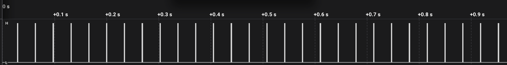
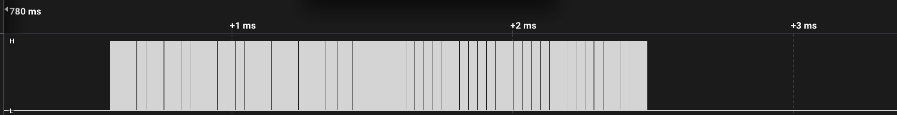
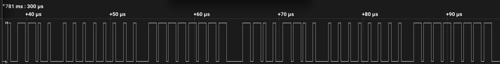

## Background

When I recently [built a gaming PC](https://se.pcpartpicker.com/b/k4QD4D), I got
a [Fractal Design Meshify 2 RGB](https://www.fractal-design.com/products/cases/meshify/meshify-2-rgb/black-tg-light-tint/)
case. This case includes a built in ARGB controller with an effect called
Northern Lights. It's a pretty subtle animation in blues, greens and purples
that I found quite nice. You can see it in the pictures on the Fractal
product page linked above.

However, the colors did not look quite as nice on the CPU fans
(of a different brand) as on the case fans, which made me curious about the
implementation.

## The WS2812b Protocol

First off, I figured out that ARGB LEDs in modern PC cases typically use the
WS2812b protocol. This pretty simple protoocol is documented in a
[datasheet](https://cdn-shop.adafruit.com/datasheets/WS2812B.pdf).
There are also some quite nice web resources available, including a
[very useful article](https://wp.josh.com/2014/05/13/ws2812-neopixels-are-not-so-finicky-once-you-get-to-know-them/)
describing some simplified timings.

## Controller Output Dump

As a next step, I used a cheap USB logic analyzer to dump the output from the
data pin of the ARGB controller for a minute or so. The raw data is available in
the repo in CSV format, although I had to trim it somewhat to avoid going over
the Github file size limit. Some screen captures of the signal:

## Color Analysis

Finally, I wrote a quick Python script (also in the repo) to analyze the data.
Here are some observations:

* The controller sends a new block of colors approximately 29.25 times per second.
* Each update, the controller sends 6 colors repeated 10 times. This means the
  effect is tuned for fans with 6 LEDs, and up to 10 such fans can be daisy
  chained. If a fan or other component with a different number of LEDs is used,
  it and any subsequent components in the chain will be out of sync. (One
  exception is of course components with a number of LEDs divisible by 6, they
  will keep in sync although the effect will be different visually.)
* After 955 updates, the patterns repeat. That means the animation is
  a little more than 30 s long.
* The color codes used for each LED in the 955 element long cycle are the same,
  but with different starting offsets.
* The average R, G and B values for one LED over the whole cycle are 17, 170 and 200.

I've made a [simple JS animation](animation.html) of the colors.
